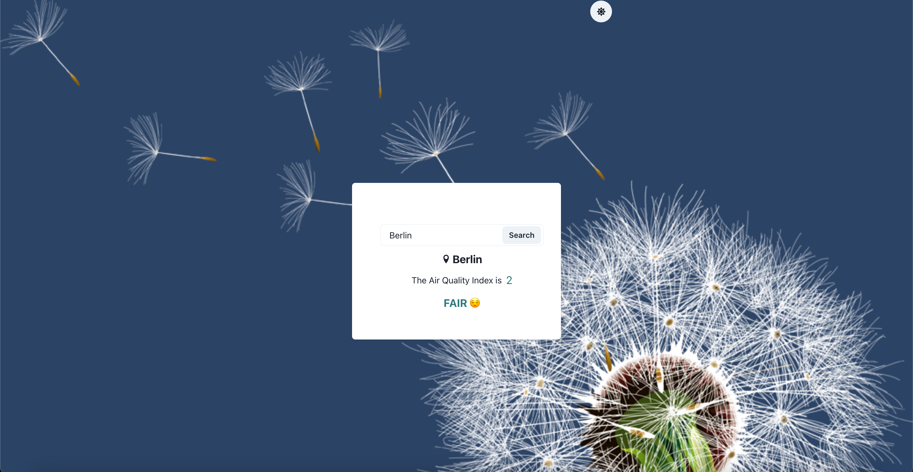

### Intro

Here is the project for [Pyladies Bratislava meetup](https://www.meetup.com/pyladies-bratislava/events/292378857/). The purpose of the project is to provide an understanding of the basics of React.js. 

There are two folders:
- `final`
- `starter`
---
### Starter

`starter` folder consists of the code to start the project for the workshop. All the code was generated by `create-react-app` and a few steps to clean the code has been done:
-  removed css files,
-  removed unneeded code in the `App.js`,
-  added `.prettier` file,
-  added `eslint` file.


1. In the terminal, go to the `starter` folder:

```s
cd starter
```
2. Install dependencies:
```s
npm i
```
3. Run the project:
```s
npm start
```

The application runs on http://localhost:3000

4. Add the key for the Open Map

We will be using the free Air Pollution API from openweathermap. 
API Documentation can be found here: https://openweathermap.org/api/air-pollution.

To get a key:
- create an account on https://openweathermap.org,
- go to https://openweathermap.org/price and click `Get API key`in the Free column, 
- generate the key,
- the key should be generated now and visible in the `My API Keys` https://home.openweathermap.org/api_keys

The generated personal key can be used and the best practice is to use it as environmental variable:
- create `.env` file inside of the `starter` folder
- assign the key to `REACT_APP_OPEN_WEATHER_API_KEY` as follows:
```
REACT_APP_OPEN_WEATHER_API_KEY=your-key-is-here
```
Now the key can be accessed in any part of the project as `process.env.REACT_APP_OPEN_WEATHER_API_KEY`

IMPORTANT: the `.env` file should not be committed, that's why it was added in `.gitignore` file.

---

### Stories

We will implement step by step following user stories: 

> 1. As user I want to see the air quality for Bratislava.

> 2. As user I want to type the name of the city in the input, click the "Show" button and the air quality index for the relevant city is displayed.

> 3. As user I want to see interpretation of the air quality index as good/fair/moderate/poor/very poor

---
### Final

`final` folder consists of the final version of the project. If you want to see the result, you can follow the same steps as above to run the code.

The final result looks as follows:



---

### Resources

Main concepts of React.js:
 - JSX: https://beta.reactjs.org/learn/writing-markup-with-jsx
 - components: https://beta.reactjs.org/learn/your-first-component
 - props: https://beta.reactjs.org/learn/passing-props-to-a-component
 - hooks: https://reactjs.org/docs/hooks-overview.html

 A re-introduction to JS:
 - https://developer.mozilla.org/en-US/docs/Web/JavaScript/Language_Overview

